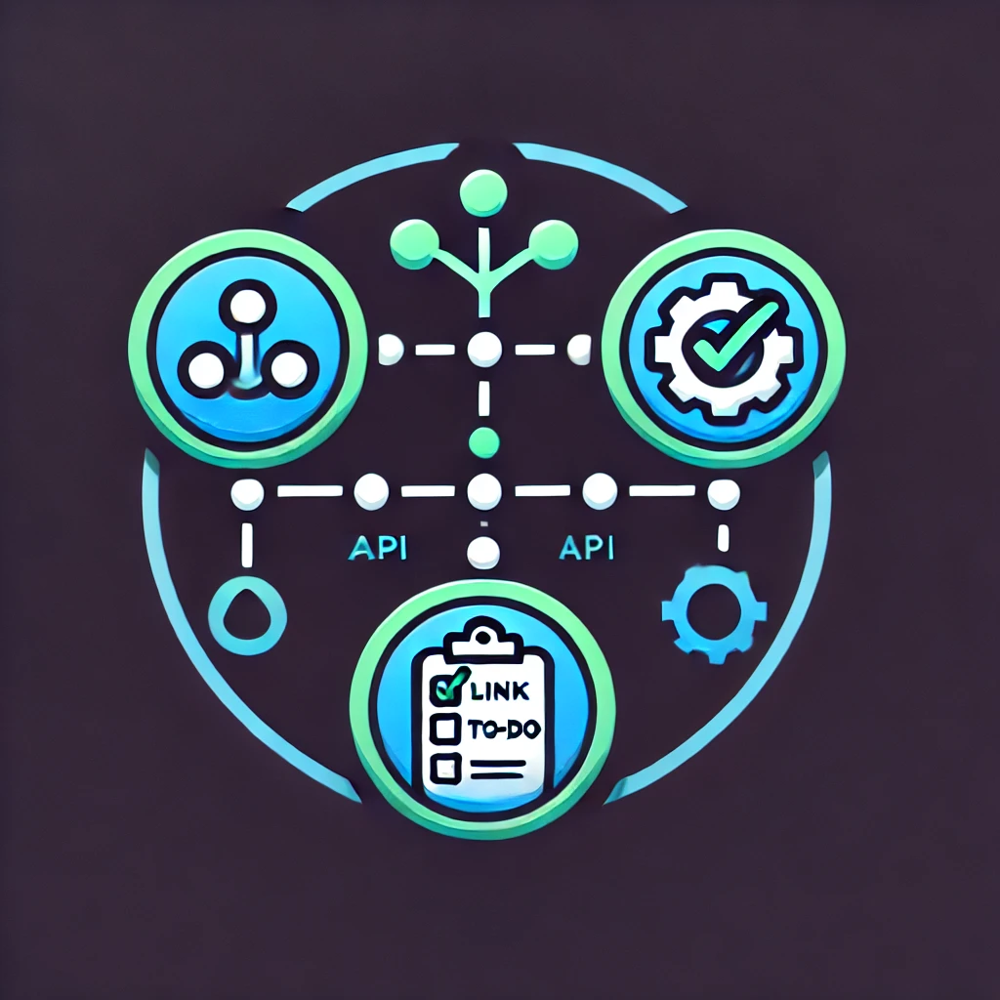

[![Contributors][contributors-shield]][contributors-url]
[![Forks][forks-shield]][forks-url]
[![Stargazers][stars-shield]][stars-url]
[![Issues][issues-shield]][issues-url]
[![project_license][license-shield]][license-url]
[![LinkedIn][linkedin-shield]][linkedin-url]


<!-- PROJECT LOGO -->
<br />
<div align="center">
  <a href="https://github.com/luka-lta/luka-lta-api">
    
  </a>

<h3 align="center">luka-lta-api</h3>

  <p align="center">
    Backend API for my system
    <br />
    <a href="https://github.com/luka-lta/luka-lta-api"><strong>Explore the docs »</strong></a>
    <br />
    <br />
    <a href="https://luka-lta.dev/">View Demo</a>
    &middot;
    <a href="https://github.com/luka-lta/luka-lta-api/issues/new?labels=bug&template=bug-report---.md">Report Bug</a>
    &middot;
    <a href="https://github.com/luka-lta/luka-lta-api/issues/new?labels=enhancement&template=feature-request---.md">Request Feature</a>
  </p>
</div>


<!-- TABLE OF CONTENTS -->
<details>
  <summary>Table of Contents</summary>
  <ol>
    <li>
      <a href="#about-the-project">About The Project</a>
      <ul>
        <li><a href="#built-with">Built With</a></li>
      </ul>
    </li>
    <li>
      <a href="#getting-started">Getting Started</a>
      <ul>
        <li><a href="#prerequisites">Prerequisites</a></li>
        <li><a href="#installation">Installation</a></li>
      </ul>
    </li>
    <li><a href="#usage">Usage</a></li>
    <li><a href="#roadmap">Roadmap</a></li>
    <li><a href="#contributing">Contributing</a></li>
    <li><a href="#license">License</a></li>
    <li><a href="#contact">Contact</a></li>
    <li><a href="#acknowledgments">Acknowledgments</a></li>
  </ol>
</details>


<!-- ABOUT THE PROJECT -->
## About The Project
This is a backend api with php and slim framework. It is used to manage links and clicks for my system.

<p align="right">(<a href="#readme-top">back to top</a>)</p>


### Built With

* [![PHP][php]][php-url]

<p align="right">(<a href="#readme-top">back to top</a>)</p>


<!-- GETTING STARTED -->
## Getting Started

This is an example of how you may give instructions on setting up your project locally.
To get a local copy up and running follow these simple example steps.

## Requirements:

- PHP 8.3 or higher
- Docker
- PHP-redis-extension 8.3 or higher

## Endpoints:

Default: `/api/v1/`

### Authentication:
- `POST /auth` | Authenticate user and retrieve an access token

### API Keys:
- `POST /key/create` | Generate a new API key (requires authentication)

### LinkCollection:
- `GET /linkCollection/links` | Get all available links (requires authentication)
- `POST /linkCollection/create` | Create a new link (requires authentication)
- `PUT /linkCollection/{linkId}` | Edit an existing link (requires authentication)
- `DELETE /linkCollection/{linkId}` | Disable an existing link (requires authentication)

### Clicks:
- `GET /click/track` | Track a click event
- `GET /click/all` | Get all click events (requires authentication)

### User Management:
- `POST /user/create` | Create a new user
- `POST /user/{userId}` | Update an existing user (requires authentication)

## Setup Instructions

### Installation:
1. Clone the repository:
   ```bash
   git clone https://github.com/luka-lta/luka-lta-backend.git
   cd luka-lta-backend
   ```

2. Install dependencies using Composer:
   ```bash
   composer install
   ```

3. Start the application using Docker:
   ```bash
   docker-compose up -d
   ```

4. Run database migrations:
   ```bash
   php artisan migrate
   ```

### Testing the API:
- Use tools like [Postman](https://www.postman.com/) or [cURL](https://curl.se/) to test the endpoints.

<p align="right">(<a href="#readme-top">back to top</a>)</p>


<!-- USAGE EXAMPLES -->
## Usage

Use this space to show useful examples of how a project can be used. Additional screenshots, code examples and demos work well in this space. You may also link to more resources.

_For more examples, please refer to the [Documentation](https://example.com)_

<p align="right">(<a href="#readme-top">back to top</a>)</p>


<!-- CONTRIBUTING -->
## Contributing

Contributions are what make the open source community such an amazing place to learn, inspire, and create. Any contributions you make are **greatly appreciated**.

If you have a suggestion that would make this better, please fork the repo and create a pull request. You can also simply open an issue with the tag "enhancement".
Don't forget to give the project a star! Thanks again!

1. Fork the Project
2. Create your Feature Branch (`git checkout -b feature/AmazingFeature`)
3. Commit your Changes (`git commit -m 'Add some AmazingFeature'`)
4. Push to the Branch (`git push origin feature/AmazingFeature`)
5. Open a Pull Request

<p align="right">(<a href="#readme-top">back to top</a>)</p>

### Top contributors:

<a href="https://github.com/luka-lta/luka-lta-api/graphs/contributors">
  
</a>


<!-- LICENSE -->
## License

Distributed under the project_license. See `LICENSE.txt` for more information.

<p align="right">(<a href="#readme-top">back to top</a>)</p>


<!-- CONTACT -->
## Contact

luka-lta - info@luka-lta.dev

Project Link: [https://github.com/luka-lta/luka-lta-api](https://github.com/luka-lta/luka-lta-api/)

<p align="right">(<a href="#readme-top">back to top</a>)</p>


<!-- ACKNOWLEDGMENTS -->
## Acknowledgments

* []()
* []()
* []()

<p align="right">(<a href="#readme-top">back to top</a>)</p>


[contributors-shield]: https://img.shields.io/github/contributors/luka-lta/luka-lta-api.svg?style=for-the-badge
[contributors-url]: https://github.com/luka-lta/luka-lta-api/graphs/contributors
[forks-shield]: https://img.shields.io/github/forks/luka-lta/luka-lta-api.svg?style=for-the-badge
[forks-url]: https://github.com/luka-lta/luka-lta-api/network/members
[stars-shield]: https://img.shields.io/github/stars/luka-lta/luka-lta-api.svg?style=for-the-badge
[stars-url]: https://github.com/luka-lta/luka-lta-api/stargazers
[issues-shield]: https://img.shields.io/github/issues/luka-lta/luka-lta-api.svg?style=for-the-badge
[issues-url]: https://github.com/luka-lta/luka-lta-api/issues
[license-shield]: https://img.shields.io/github/license/luka-lta/luka-lta-api.svg?style=for-the-badge
[license-url]: https://github.com/luka-lta/luka-lta-api/blob/master/LICENSE.txt
[linkedin-shield]: https://img.shields.io/badge/-LinkedIn-black.svg?style=for-the-badge&logo=linkedin&colorB=555
[linkedin-url]: https://linkedin.com/in/linkedin_username
[PHP]: https://img.shields.io/badge/php-000000?style=for-the-badge&logo=php&logoColor=white
[php-url]: https://php.com/